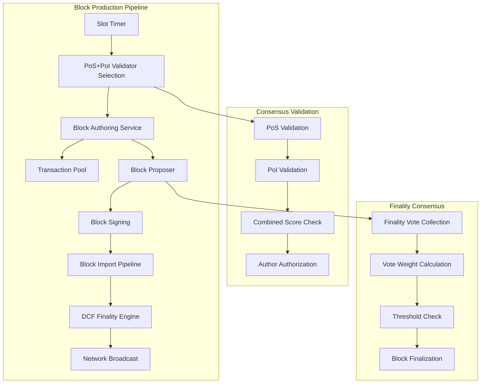

# Design Document

## Overview

This design implements a real block production system for the CBC blockchain that replaces the current simulation with actual block authoring. The system integrates three key components:

1. **PoS+PoI Consensus Engine**: Handles validator selection and block production authorization
2. **Substrate Block Authoring**: Creates real blocks with transactions using Substrate's authoring framework
3. **DCF Finality Engine**: Provides finality consensus for produced blocks

The architecture follows Substrate's consensus patterns while implementing the custom PoS+PoI+DCF consensus mechanism.

## Architecture

### High-Level Architecture



### Component Architecture

#### 1. Block Authoring Service
- **Purpose**: Coordinates block production using Substrate's authoring framework
- **Integration**: Uses `sc_consensus::Proposer` and `sc_basic_authorship::ProposerFactory`
- **Responsibilities**:
  - Manages slot-based timing
  - Coordinates with PoS+PoI for validator selection
  - Creates block proposals with transactions
  - Handles block signing and import

#### 2. PoS+PoI Consensus Engine
- **Purpose**: Validates validators and authorizes block production
- **Integration**: Extends existing `DcfConsensus` with real block production
- **Responsibilities**:
  - Validates PoS stake requirements
  - Validates PoI inference scores
  - Calculates combined consensus scores
  - Authorizes block production attempts

#### 3. DCF Finality Engine
- **Purpose**: Provides finality consensus for produced blocks
- **Integration**: Integrates with Substrate's finality system
- **Responsibilities**:
  - Collects finality votes from validators
  - Weights votes by PoS+PoI scores
  - Applies finality thresholds
  - Marks blocks as finalized

## Components and Interfaces

### 1. Block Authoring Service

```rust
pub struct CbcBlockAuthoring<C, P, SC> {
    client: Arc<C>,
    proposer_factory: P,
    select_chain: SC,
    transaction_pool: Arc<TransactionPool>,
    consensus_engine: Arc<Mutex<DcfConsensus<Block, C>>>,
    finality_engine: Arc<Mutex<DcfFinality<Block, C>>>,
    slot_duration: Duration,
    keystore: KeystorePtr,
}

impl<C, P, SC> CbcBlockAuthoring<C, P, SC> {
    pub async fn run_authoring_loop(&mut self) -> Result<()>;
    pub async fn produce_block_in_slot(&mut self, slot: Slot) -> Result<()>;
    pub async fn create_block_proposal(&self, author: &Public) -> Result<BlockProposal>;
    pub async fn sign_and_import_block(&self, proposal: BlockProposal) -> Result<()>;
}
```

### 2. Enhanced PoS+PoI Consensus Engine

```rust
impl<B, C> DcfConsensus<B, C> {
    // New methods for real block production
    pub async fn authorize_block_production(&self, slot: Slot) -> Result<Option<Public>>;
    pub async fn validate_block_author(&self, author: &Public, slot: Slot) -> Result<()>;
    pub async fn create_substrate_proposer(&self) -> Result<Box<dyn Proposer<Block>>>;
    pub async fn submit_to_finality(&self, block: Block) -> Result<()>;
}
```

### 3. Enhanced DCF Finality Engine

```rust
impl<B, C> DcfFinality<B, C> {
    // New methods for real finality
    pub async fn process_imported_block(&mut self, block: Block) -> Result<()>;
    pub async fn collect_real_finality_votes(&self, block_hash: Hash) -> Result<Vec<FinalityVote>>;
    pub async fn apply_finality_to_block(&self, block_hash: Hash) -> Result<FinalityStatus>;
    pub async fn notify_substrate_finality(&self, block_hash: Hash) -> Result<()>;
}
```

### 4. Substrate Integration Layer

```rust
pub struct CbcProposerFactory<C, P> {
    client: Arc<C>,
    transaction_pool: Arc<P>,
    consensus_engine: Arc<Mutex<DcfConsensus<Block, C>>>,
}

impl<C, P> ProposerFactory<Block> for CbcProposerFactory<C, P> {
    type Proposer = CbcProposer<C, P>;
    
    fn init(&mut self, parent_header: &Header) -> Result<Self::Proposer>;
}

pub struct CbcProposer<C, P> {
    client: Arc<C>,
    transaction_pool: Arc<P>,
    parent_header: Header,
    consensus_data: ConsensusData,
}

impl<C, P> Proposer<Block> for CbcProposer<C, P> {
    fn propose(&mut self, inherents: InherentData, digests: Digest) -> Result<Proposal<Block>>;
}
```

## Data Models

### Block Production Models

```rust
#[derive(Debug, Clone)]
pub struct SlotInfo {
    pub slot: Slot,
    pub timestamp: u64,
    pub expected_author: Option<Public>,
    pub author_score: Option<u64>,
}

#[derive(Debug, Clone)]
pub struct BlockProposal {
    pub header: Header,
    pub body: Vec<Extrinsic>,
    pub author: Public,
    pub slot: Slot,
    pub consensus_data: ConsensusData,
}

#[derive(Debug, Clone)]
pub struct ConsensusData {
    pub pos_score: u64,
    pub poi_score: u64,
    pub combined_score: u64,
    pub validation_timestamp: u64,
}
```

### Finality Models

```rust
#[derive(Debug, Clone, Encode, Decode)]
pub struct RealFinalityVote {
    pub block_hash: Hash,
    pub block_number: BlockNumber,
    pub validator: AccountId,
    pub vote: FinalityVoteType,
    pub signature: Signature,
    pub validator_score: u64,
}

#[derive(Debug, Clone, Encode, Decode)]
pub enum FinalityVoteType {
    Finalize,
    Reject,
    Abstain,
}

#[derive(Debug, Clone)]
pub struct FinalityRound {
    pub block_hash: Hash,
    pub votes: Vec<RealFinalityVote>,
    pub total_weight: u64,
    pub finalize_weight: u64,
    pub status: FinalityStatus,
}
```

## Error Handling

### Block Production Errors

```rust
#[derive(Debug, thiserror::Error)]
pub enum BlockProductionError {
    #[error("Validator not authorized for slot {slot}: {reason}")]
    ValidatorNotAuthorized { slot: Slot, reason: String },
    
    #[error("Block proposal creation failed: {0}")]
    ProposalCreationFailed(String),
    
    #[error("Block signing failed: {0}")]
    BlockSigningFailed(String),
    
    #[error("Block import failed: {0}")]
    BlockImportFailed(String),
    
    #[error("Transaction pool error: {0}")]
    TransactionPoolError(String),
}
```

### Finality Errors

```rust
#[derive(Debug, thiserror::Error)]
pub enum FinalityError {
    #[error("Insufficient finality votes: got {got}, need {need}")]
    InsufficientVotes { got: usize, need: usize },
    
    #[error("Finality threshold not met: {percentage}% < {threshold}%")]
    ThresholdNotMet { percentage: u64, threshold: u64 },
    
    #[error("Invalid finality vote: {0}")]
    InvalidVote(String),
    
    #[error("Finality timeout for block {block_hash}")]
    FinalityTimeout { block_hash: Hash },
}
```

## Testing Strategy

### Unit Tests

1. **Block Authoring Tests**
   - Test slot-based validator selection
   - Test block proposal creation with transactions
   - Test block signing and validation
   - Test error handling for invalid authors

2. **PoS+PoI Consensus Tests**
   - Test validator authorization logic
   - Test score calculation and thresholds
   - Test consensus validation pipeline
   - Test integration with Substrate proposer

3. **DCF Finality Tests**
   - Test finality vote collection and weighting
   - Test threshold-based finality decisions
   - Test finality timeout handling
   - Test integration with Substrate finality

### Integration Tests

1. **End-to-End Block Production**
   - Test complete block production pipeline
   - Test multiple validators producing blocks
   - Test block finalization process
   - Test network synchronization

2. **Consensus Integration**
   - Test PoS+PoI+DCF consensus flow
   - Test validator set changes
   - Test epoch transitions
   - Test consensus failure recovery

3. **Substrate Integration**
   - Test integration with Substrate's authoring
   - Test transaction pool integration
   - Test block import pipeline
   - Test network block propagation

### Performance Tests

1. **Block Production Performance**
   - Measure block production latency
   - Test transaction throughput
   - Measure consensus validation time
   - Test finality confirmation time

2. **Scalability Tests**
   - Test with varying validator set sizes
   - Test with high transaction volumes
   - Test network propagation delays
   - Test consensus under load

## Implementation Phases

### Phase 1: Substrate Integration Foundation
- Implement `CbcProposerFactory` and `CbcProposer`
- Integrate with Substrate's transaction pool
- Set up basic block import pipeline
- Implement slot-based timing system

### Phase 2: Real Block Production
- Implement `CbcBlockAuthoring` service
- Integrate PoS+PoI validator selection
- Implement real block creation with transactions
- Add block signing and import functionality

### Phase 3: DCF Finality Integration
- Implement real finality vote collection
- Integrate finality with Substrate's finality system
- Add finality notification and metrics
- Implement finality timeout handling

### Phase 4: Optimization and Monitoring
- Add comprehensive metrics and monitoring
- Optimize block production performance
- Implement advanced error recovery
- Add network synchronization improvements