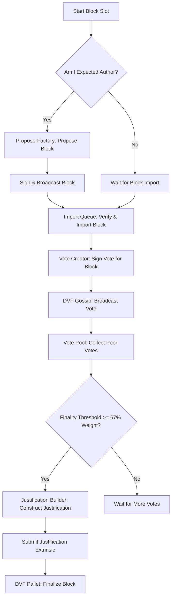

# CBC Consensus Engine (`cbc-consensus`)

[](https://github.com/bharathkumarachari/cbc-chain/actions)
[](LICENSE)

<p align="center">
  
</p>

A high-performance, production-grade hybrid consensus engine for the CBC Blockchain. It implements the **Dynamic Consensus Framework (DCF)**, combining Proof of Stake (PoS) economic security with Proof of Inference (PoI) computational capability, coupled with the **Dynamic Voting Framework (DVF)** for fast BFT-style block finalization.

---

## Table of Contents
1. [Overview & Consensus Hybrid Model](#overview--consensus-hybrid-model)
2. [Architecture & Component Mapping](#architecture--component-mapping)
3. [Core Consensus Workflows](#core-consensus-workflows)
4. [Lifecycle Tracer System](#lifecycle-tracer-system)
5. [Prometheus Metrics Catalog](#prometheus-metrics-catalog)
6. [Getting Started & Development](#getting-started--development)
7. [Troubleshooting & FAQ](#troubleshooting--faq)

---

## Overview & Consensus Hybrid Model

The CBC blockchain employs a hybrid PoS/PoI consensus mechanism that ensures network safety while promoting AI/ML execution efficiency.

```
                  +-----------------------------------+
                  |      Consensus Score (10000 BP)   |
                  +-----------------+-----------------+
                                    |
            +-----------------------+-----------------------+
            | (Weight: PoS Weight)                          | (Weight: PoI Weight)
            v                                               v
+-----------------------+                       +-----------------------+
|   Proof of Stake      |                       |   Proof of Inference  |
|   (Validator Stake)   |                       |  (AI/ML Task Uptime)  |
+-----------------------+                       +-----------------------+
```

### The Scoring Formulation
Validators are ranked and selected based on their combined score:
$$\text{Final Score} = \frac{(\text{PoS Score} \times \text{PoS Weight}) + (\text{PoI Score} \times \text{PoI Weight})}{\text{Percentage Precision}}$$

- **Proof of Stake (PoS)**: Score derived from the validator's reserved token stake.
- **Proof of Inference (PoI)**: Score calculated from the validator's historical execution performance, uptime, and validation accuracy for machine learning/inference tasks.
- **Dynamic Adaptability**: Weights can be adjusted at runtime via governance to prioritize economic security (PoS) or computational output (PoI) dynamically.

---

## Architecture & Component Mapping

The `cbc-consensus` crate is highly modular, separating block production, networking gossip, vote aggregation, and lifecycle tracking.

```
cbc-consensus/
├── src/
│   ├── dcf.rs                    # Dynamic Consensus Framework Core Loop
│   ├── author_selection.rs       # Validator Selection Algorithms
│   ├── validator_set.rs          # Validator Registry & Metadata Cache
│   ├── proposer_factory.rs       # Proposer Factory for Block Building
│   ├── block_import.rs           # Block Import Validation Hooks
│   ├── import_queue.rs           # Block Import Queue & Processing Engine
│   ├── inherent_providers.rs     # System Inherent Data Management
│   ├── finality.rs               # Finality Engine State Tracking
│   ├── dvf_gossip.rs             # DVF Gossip Network Communication Layer
│   ├── dvf_config_validator.rs   # Gossip Message Validation Logic
│   ├── vote_creator.rs           # Vote Generation & Signing
│   ├── vote_aggregator.rs        # Vote Quorum (67%) Accumulator
│   ├── justification_builder.rs  # Justification (Quorum Proof) Construction
│   ├── lifecycle_tracer/         # Node Startup & Operations Tracing
│   │   ├── config.rs             # Tracer configuration parameters
│   │   ├── entry.rs              # Trace structures & metadata
│   │   ├── formatter.rs          # JSON / Human-readable formatters
│   │   ├── output.rs             # Stdout, File, & Prometheus Outputs
│   │   └── buffer.rs             # Safe buffered asynchronous flusher
│   ├── lifecycle_tracer.rs       # Global LifecycleTracer Interface
│   ├── metrics.rs                # Prometheus Registry & Gauge Definitions
│   ├── types.rs                  # Core Consensus Datatypes & Params
│   ├── error.rs                  # Error Handling definitions
│   ├── lib.rs                    # Public API Interface Export
│   ├── mock.rs                   # Testing Runtime Mock configuration
│   └── tests/                    # Crate Integration Tests
```

---

## Core Consensus Workflows



### 1. Block Production Loop (`dcf.rs`)
At each slot duration boundary (6 seconds), the block production loop triggers:
1. Queries the Runtime API to identify the expected author for the current block height.
2. If the local node's authority key matches the expected author, it triggers the `ProposerFactory`.
3. The Proposer compiles pending transactions from the transaction pool, appends the inherent data (e.g., timestamp), generates the block, signs it, and broadcasts it to the network.

### 2. DVF Voting & Gossip (`vote_creator.rs`, `dvf_gossip.rs`)
1. Upon successful import of a new block, every validator generates a signed vote mapping the block number and block hash.
2. Votes are broadcasted via libp2p gossip topics dedicated to the current consensus epoch.
3. Message signatures and validator indices are validated dynamically (`dvf_config_validator.rs`) to protect the pool from spam attacks.

### 3. Justification & Finalization (`vote_aggregator.rs`, `justification_builder.rs`)
1. Nodes collect votes from peer validators.
2. The `VoteAggregator` tracks the accumulated voting weight for each block candidate.
3. Once a candidate block accumulates $\ge 67\%$ (two-thirds) of the active validator set's voting weight, a justification is constructed.
4. A justification is a cryptographic proof containing the aggregated signatures of the voting validators.
5. The justifying node submits a `submit_justification` extrinsic, finalizing the block permanently on the blockchain.

---

## Lifecycle Tracer System

The node includes a comprehensive step-by-step tracer tracking the node's progress from boot to consensus stability.

### Supported Destinations
- **Stdout**: Human-readable, colorized output for developers.
- **File**: Append-only log file (`0o600` permissions) suited for ingestion pipelines.
- **Metrics**: Exposes counters and gauges to Prometheus for real-time dashboard tracking.

### Key Tracer Steps
* **Step 1 - 10**: CLI Initialization, Logging Setup, and Database opening.
* **Step 11 - 25**: Keystore initialization, Genesis validation, and Network key generation.
* **Step 26 - 40**: Peer discovery, Sync service startup, and Gossip engine bindings.
* **Step 41 - 50**: Block production engine start, DVF listener bindings.
* **Step 51+**: Block authoring stats, finalization advancements, and periodic health checks.

---

## Prometheus Metrics Catalog

The consensus engine registers and tracks the following metrics under the standard Prometheus interface:

### 1. Consensus Core Metrics
| Metric Name | Type | Description |
|---|---|---|
| `cbc_consensus_active_validators` | Gauge | Count of active validators in the current epoch. |
| `cbc_consensus_total_reserved_stake` | Gauge | Total tokens staked by active validators. |
| `cbc_consensus_current_epoch` | Gauge | Current consensus epoch number. |
| `cbc_author_mismatch_total` | Counter | Cumulative block author mismatch warnings. |
| `cbc_epoch_transitions_total` | Counter | Cumulative count of epoch transitions. |
| `cbc_validator_score` | GaugeVec | Current trust scores labeled by validator ID. |
| `cbc_block_production_time_seconds` | Histogram | Duration taken by local node to propose blocks. |
| `cbc_rpc_request_duration_seconds` | HistogramVec| Timing metrics for consensus RPC endpoints. |

### 2. Node Lifecycle Metrics
| Metric Name | Type | Description |
|---|---|---|
| `cbc_lifecycle_step_total` | Counter | Total trace steps executed by the node. |
| `cbc_lifecycle_last_step` | Gauge | Highest step number reached in the lifecycle. |
| `cbc_lifecycle_errors_total` | Counter | Total error events caught by the tracer. |
| `cbc_lifecycle_milestones_total` | Counter | Total milestone markers reached. |

---

## Getting Started & Development

### 1. Compilation
Build the consensus library locally in debug or release mode:
```bash
# Debug build
cargo build -p cbc-consensus

# Release build (recommended for running nodes)
cargo build --release -p cbc-consensus
```

### 2. Running Unit Tests
Execute the comprehensive test suite covering validator sets, metrics, and proposer integrations:
```bash
# Run all tests in the consensus package
cargo test -p cbc-consensus --all-features

# Run a specific test suite
cargo test -p cbc-consensus validator_set_test

# Run tests showing debug logs
cargo test -p cbc-consensus -- --nocapture
```

### 3. CLI Integration
The consensus engine behavior can be customized at boot time via standard CLI arguments:
```bash
./target/release/cbc-node \
  --chain local \
  --validator \
  --rpc-methods Safe \
  --prometheus-external
```

---

## Troubleshooting & FAQ

#### Q: The node log periodically shows `Idle (0 peers)`, has a chain fork occurred?
**No.** The `Idle (X peers)` log line displays active connections on the **block replication sync substream**. When a node is fully synchronized and at the tip of the canonical chain, the sync engine goes idle and may close peer sync streams to save resources. The consensus gossip and voting protocols continue to operate on separate, dedicated libp2p substreams. As long as block numbers are advancing and block hashes match across nodes, the network is fully canonical and healthy.

#### Q: How is validator uptime calculated?
Uptime is computed as the percentage of blocks authored relative to block slots expected. A grace period is automatically granted to new validators (who have not yet been assigned block production slots) to prevent false penalization. Uptime metrics return `None` (logged as `N/A`) if the runtime state is unavailable.

#### Q: How can I change the PoS/PoI weighting?
The weights are configured in the runtime configuration. Authorized governance proposals can dynamically update weights on-chain via the `update_consensus_weights` call.
