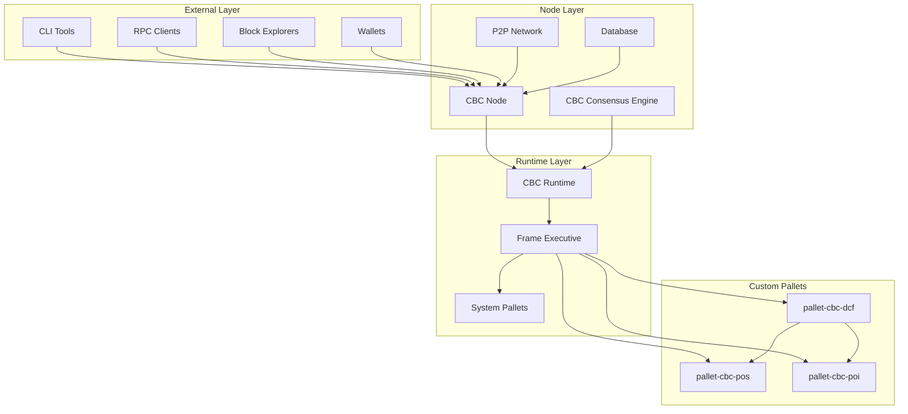
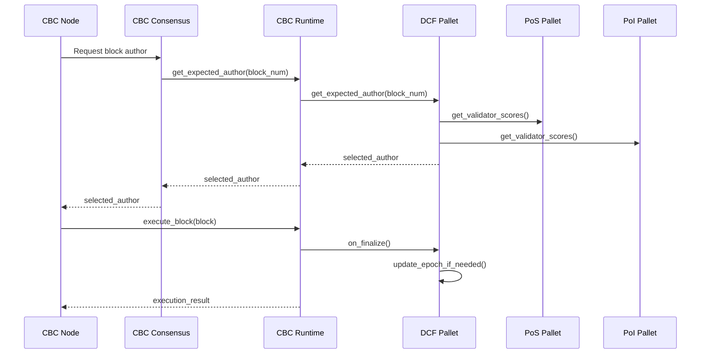
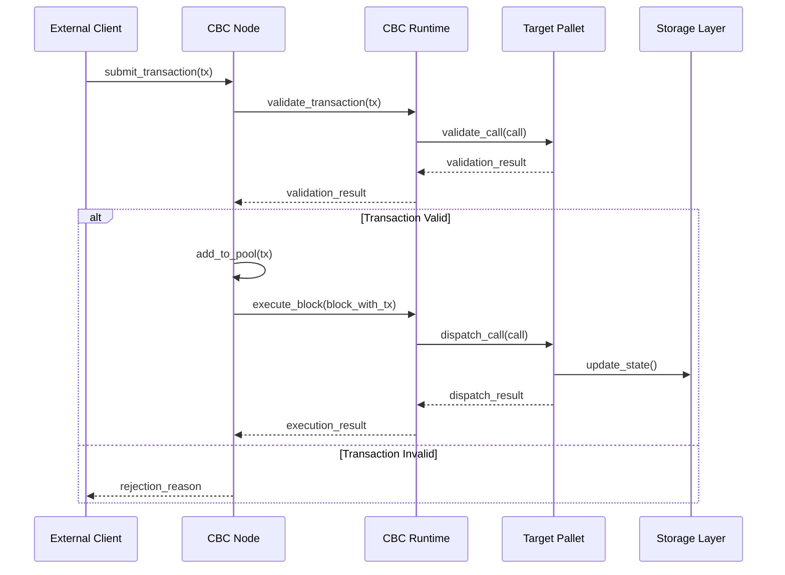
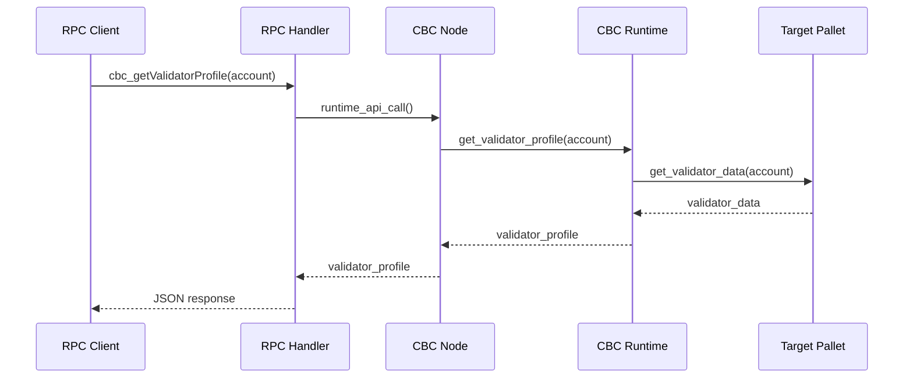
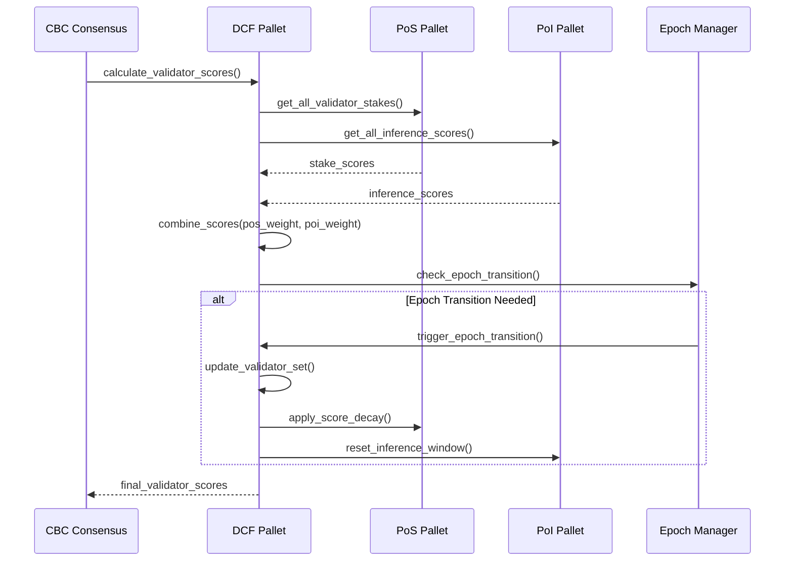
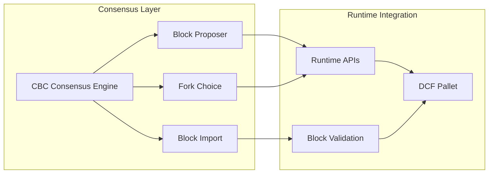
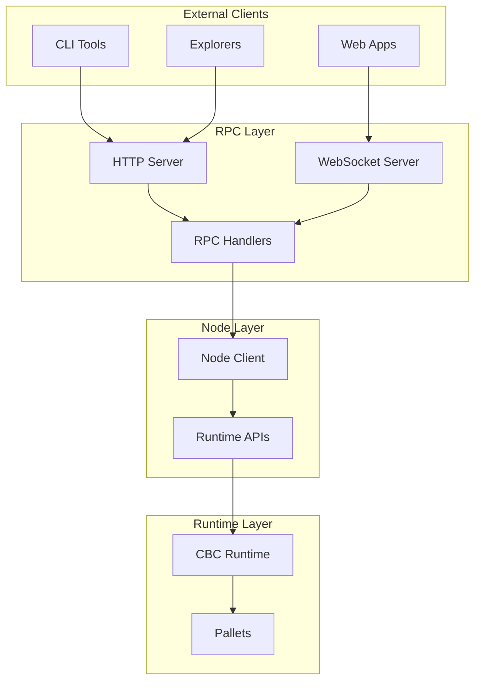
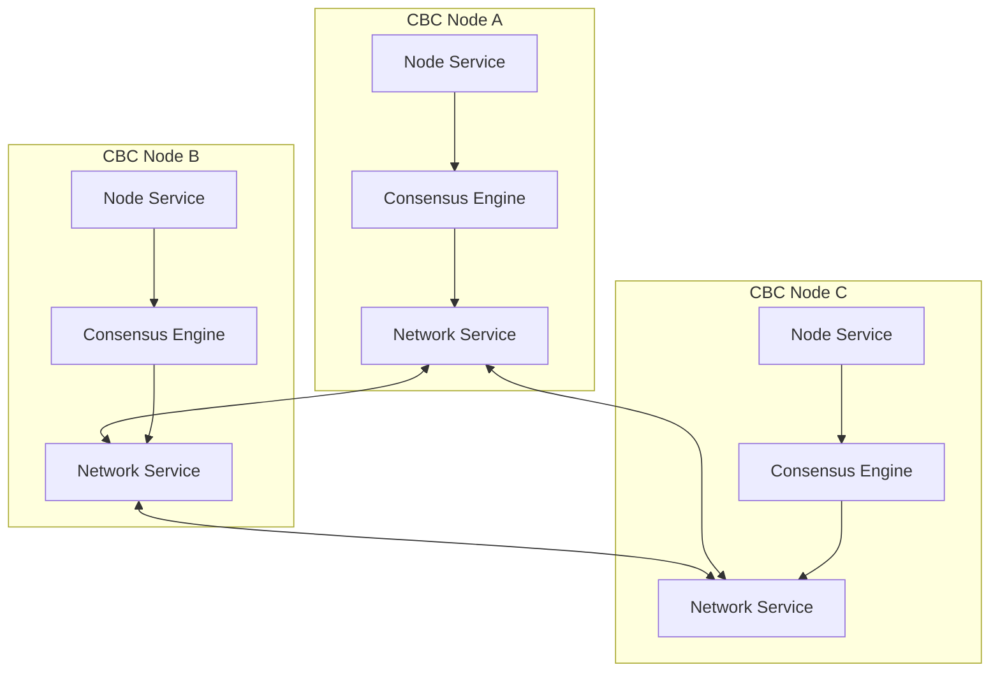
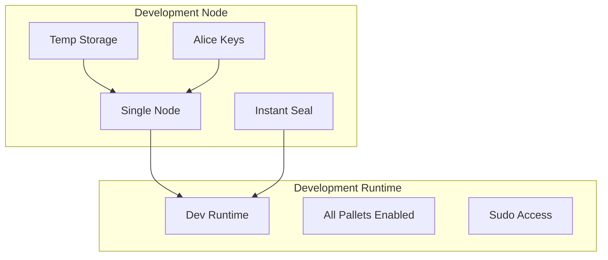
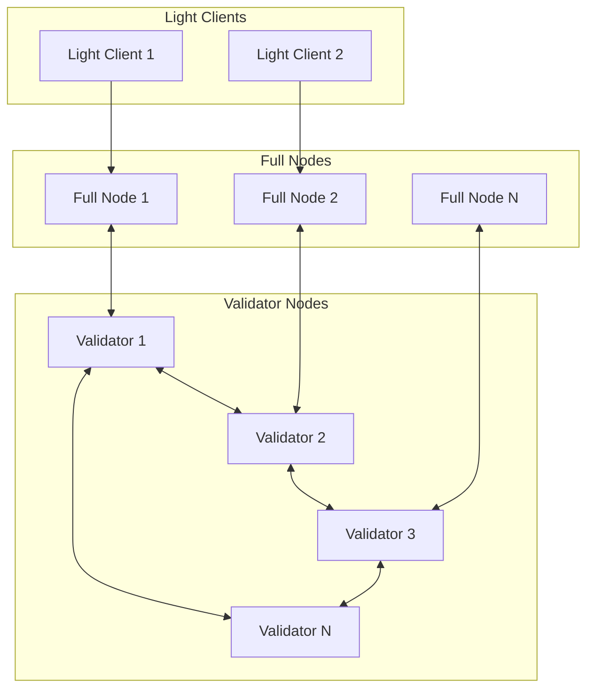

# CBC Node Architecture

This document provides a comprehensive overview of the CBC Chain node architecture, explaining the relationships between the node, runtime, and pallets, along with detailed component interaction flows.

## Table of Contents

1. [Architecture Overview](#architecture-overview)
2. [Core Components](#core-components)
3. [Node-Runtime-Pallet Relationships](#node-runtime-pallet-relationships)
4. [Component Interaction Flows](#component-interaction-flows)
5. [Consensus Architecture](#consensus-architecture)
6. [RPC Layer Architecture](#rpc-layer-architecture)
7. [Storage Architecture](#storage-architecture)
8. [Network Architecture](#network-architecture)
9. [Development vs Production Architecture](#development-vs-production-architecture)

## Architecture Overview

CBC Chain follows Substrate's modular architecture pattern, consisting of three main layers:



### Layer Responsibilities

1. **Node Layer**: Handles networking, consensus, storage, and external interfaces
2. **Runtime Layer**: Contains business logic, state transitions, and pallet orchestration
3. **Pallet Layer**: Implements specific functionality modules (DCF, PoS, PoI)

## Core Components

### 1. CBC Node (`cbc-node`)

The node is the executable that runs the blockchain client and provides the infrastructure for the runtime.

**Key Files**:
- `src/main.rs` - Entry point and CLI setup
- `src/service.rs` - Node service configuration
- `src/rpc.rs` - RPC endpoint implementations
- `src/chain_spec.rs` - Chain specification and genesis configuration
- `src/cli.rs` - Command-line interface definitions

**Responsibilities**:
- Network communication with peers
- Block production and import
- Transaction pool management
- RPC server hosting
- Database management
- Consensus engine coordination

### 2. CBC Runtime (`cbc-runtime`)

The runtime contains the state transition function and business logic of the blockchain.

**Key Files**:
- `src/lib.rs` - Runtime configuration and pallet integration
- `src/configs/` - Individual pallet configurations
- `src/apis.rs` - Runtime API implementations

**Responsibilities**:
- State transition logic
- Transaction validation and execution
- Block validation
- Runtime API exposure
- Pallet orchestration

### 3. Custom Pallets

#### DCF Pallet (`pallet-cbc-dcf`)
**Purpose**: Implements the Dynamic Consensus Framework that combines PoS and PoI scores.

**Key Components**:
- Validator score calculation
- Epoch management
- Consensus weight configuration
- Validator set management

#### PoS Pallet (`pallet-cbc-pos`)
**Purpose**: Implements Proof of Stake functionality.

**Key Components**:
- Validator registration
- Stake management
- Slashing logic
- Score calculation

#### PoI Pallet (`pallet-cbc-poi`)
**Purpose**: Implements Proof of Inference functionality.

**Key Components**:
- Inference result submission
- Challenge mechanism
- Confidence scoring
- Validation logic

### 4. CBC Consensus Engine (`cbc-consensus`)

Custom consensus implementation that integrates with the DCF pallet.

**Key Files**:
- `src/lib.rs` - Main consensus interface and module exports
- `src/dcf.rs` - DCF-specific consensus logic and main engine
- `src/epoch_manager.rs` - Epoch transition handling
- `src/validator_set.rs` - Validator set management
- `src/block_import.rs` - Block import validation
- `src/author_selection.rs` - Validator and author selection logic
- `src/proposer_factory.rs` - Block proposer creation
- `src/import_queue.rs` - Import queue management
- `src/inherent_providers.rs` - Inherent data providers
- `src/finality.rs` - Finality engine
- `src/metrics.rs` - Consensus monitoring and metrics
- `src/types.rs` - Core consensus types
- `src/error.rs` - Error handling

**Key Components**:
- **DcfConsensus**: Main consensus engine implementation
- **ProposerFactory**: Creates block proposers with DCF validator selection
- **CbcBlockImport**: Validates blocks according to DCF rules
- **FinalityEngine**: Handles block finalization
- **EpochManager**: Manages validator set transitions
- **AuthorSelection**: Implements validator selection algorithms
- **ConsensusMetrics**: Provides monitoring and telemetry

## Node-Runtime-Pallet Relationships

### 1. Node ↔ Runtime Communication

The node communicates with the runtime through well-defined APIs:

```rust
// Node calls runtime through Runtime APIs
impl sp_api::ProvideRuntimeApi<Block> for Client {
    type Api = RuntimeApi;
}

// Runtime exposes APIs for node consumption
impl_runtime_apis! {
    impl sp_api::Core<Block> for Runtime {
        fn version() -> RuntimeVersion { /* ... */ }
        fn execute_block(block: Block) { /* ... */ }
    }
    
    impl DcfApi<Block, AccountId> for Runtime {
        fn get_current_epoch() -> u32 { /* ... */ }
        fn get_validator_scores() -> Vec<(AccountId, u64)> { /* ... */ }
    }
}
```

**Communication Patterns**:
- **Runtime API Calls**: Node queries runtime state and metadata
- **Block Execution**: Node requests runtime to execute blocks
- **Transaction Validation**: Node asks runtime to validate transactions
- **State Queries**: Node retrieves state information from runtime

### 2. Runtime ↔ Pallet Integration

The runtime orchestrates pallets through the FRAME system:

```rust
// Runtime configuration integrates pallets
construct_runtime!(
    pub struct Runtime {
        System: frame_system,
        Timestamp: pallet_timestamp,
        Balances: pallet_balances,
        TransactionPayment: pallet_transaction_payment,
        Sudo: pallet_sudo,
        
        // Custom pallets
        CbcPoI: pallet_cbc_poi,
        CbcPoS: pallet_cbc_pos,
        CbcDcf: pallet_cbc_dcf,
    }
);

// Pallet configuration in runtime
impl pallet_cbc_dcf::Config for Runtime {
    type RuntimeEvent = RuntimeEvent;
    type WeightInfo = ();
    type MaxValidators = ConstU32<100>;
    // ... other configurations
}
```

**Integration Mechanisms**:
- **Configuration Traits**: Runtime implements pallet configuration traits
- **Event Aggregation**: Runtime collects events from all pallets
- **Call Dispatch**: Runtime routes calls to appropriate pallets
- **Storage Access**: Pallets access storage through runtime context

### 3. Inter-Pallet Communication

Pallets communicate through tight coupling and loose coupling patterns:

```rust
// Tight coupling: Direct trait implementation
impl pallet_cbc_dcf::Config for Runtime {
    type PosInterface = CbcPoS;  // Direct pallet reference
    type PoiInterface = CbcPoI;  // Direct pallet reference
}

// Loose coupling: Through runtime events
impl pallet_cbc_dcf::Pallet<T> {
    fn on_epoch_transition() {
        // Listen to events from other pallets
        let pos_scores = T::PosInterface::get_all_scores();
        let poi_scores = T::PoiInterface::get_all_scores();
        
        // Calculate combined scores
        Self::update_validator_scores(pos_scores, poi_scores);
    }
}
```

## Component Interaction Flows

### 1. Block Production Flow



### 2. Transaction Processing Flow



### 3. RPC Query Flow



### 4. Consensus Decision Flow



## Consensus Architecture

### 1. DCF Consensus Engine

The CBC Consensus Engine implements a custom consensus mechanism:

```rust
// Main consensus engine
pub struct DcfConsensus<B, E, Block, RA, SC, CAW> {
    // Implementation details
}

// Consensus parameters
pub struct ConsensusParams {
    pub author_selection_mode: AuthorSelectionMode,
    pub epoch_config: EpochConfig,
    // Other configuration parameters
}

// Author selection modes
pub enum AuthorSelectionMode {
    RoundRobin,
    ScoreBased,
    Hybrid,
}
```

**Key Components**:
- **DcfConsensus**: Main consensus engine with DCF validator selection
- **ProposerFactory**: Creates proposers with DCF-aware block production
- **CbcBlockImport**: Validates blocks according to DCF rules and validator scores
- **FinalityEngine**: Handles block finalization with DCF considerations
- **EpochManager**: Manages validator set transitions and epoch boundaries
- **AuthorSelection**: Implements multiple validator selection algorithms

### 2. Consensus Integration Points



## RPC Layer Architecture

### 1. RPC Handler Structure

```rust
// RPC trait definition
#[rpc(server)]
pub trait CbcRpcApi<AccountId, Balance> {
    #[method(name = "cbc_getCurrentEpoch")]
    fn get_current_epoch(&self) -> RpcResult<u32>;
    
    #[method(name = "cbc_getValidatorProfile")]
    fn get_validator_profile(&self, validator: AccountId) -> RpcResult<ValidatorProfile>;
}

// RPC implementation
pub struct CbcRpcApiImpl<C, Block> {
    client: Arc<C>,
    _marker: PhantomData<Block>,
}

impl<C, Block, AccountId, Balance> CbcRpcApiServer<AccountId, Balance> 
    for CbcRpcApiImpl<C, Block>
where
    C: ProvideRuntimeApi<Block> + HeaderBackend<Block> + 'static,
    Block: BlockT,
{
    fn get_current_epoch(&self) -> RpcResult<u32> {
        let api = self.client.runtime_api();
        let at = self.client.info().best_hash;
        
        api.get_current_epoch(at)
            .map_err(|e| RpcError::from(e))
    }
}
```

### 2. RPC Layer Flow



## Storage Architecture

### 1. Storage Layers

CBC Chain uses a multi-layered storage architecture:

```mermaid
graph TB
    subgraph "Application Layer"
        Pallets[Pallet Storage]
        State[State Queries]
    end
    
    subgraph "Runtime Layer"
        Trie[State Trie]
        Cache[Storage Cache]
    end
    
    subgraph "Node Layer"
        Backend[Storage Backend]
        DB[Database (RocksDB)]
    end
    
    Pallets --> Trie
    State --> Cache
    Trie --> Backend
    Cache --> Backend
    Backend --> DB
```

### 2. Storage Access Patterns

```rust
// Pallet storage definitions
#[pallet::storage]
#[pallet::getter(fn validator_scores)]
pub type ValidatorScores<T: Config> = StorageMap<
    _,
    Blake2_128Concat,
    T::AccountId,
    ValidatorScore,
    OptionQuery,
>;

// Storage access in pallet functions
impl<T: Config> Pallet<T> {
    pub fn get_validator_score(who: &T::AccountId) -> Option<ValidatorScore> {
        ValidatorScores::<T>::get(who)
    }
    
    pub fn update_validator_score(who: &T::AccountId, score: ValidatorScore) {
        ValidatorScores::<T>::insert(who, score);
        Self::deposit_event(Event::ValidatorScoreUpdated { who: who.clone(), score });
    }
}
```

## Network Architecture

### 1. P2P Network Structure



### 2. Network Protocol Stack

```rust
// Network configuration
pub fn new_partial(config: &Configuration) -> Result<PartialComponents, ServiceError> {
    let (network, system_rpc_tx, tx_handler_controller, network_starter, sync_service) =
        sc_service::build_network(sc_service::BuildNetworkParams {
            config: &config,
            client: client.clone(),
            transaction_pool: transaction_pool.clone(),
            spawn_handle: task_manager.spawn_handle(),
            import_queue,
            block_announce_validator_builder: None,
            warp_sync_params: None,
            block_relay: None,
        })?;
    
    Ok(PartialComponents {
        client,
        backend,
        task_manager,
        import_queue,
        keystore_container,
        select_chain,
        transaction_pool,
        network,
        system_rpc_tx,
        tx_handler_controller,
        sync_service,
        network_starter,
    })
}
```

## Development vs Production Architecture

### 1. Development Mode

In development mode (`--dev` flag), the architecture is simplified:



**Characteristics**:
- Single validator (Alice)
- Instant block finalization
- Temporary storage
- All features enabled
- Sudo access for testing

### 2. Production Mode

Production architecture supports multiple validators and real consensus:



**Characteristics**:
- Multiple validators with DCF consensus
- Real economic incentives
- Persistent storage
- Security-focused configuration
- No sudo access

### 3. Configuration Differences

```rust
// Development chain spec
pub fn development_config() -> Result<ChainSpec, String> {
    let wasm_binary = WASM_BINARY.ok_or_else(|| "Development wasm not available".to_string())?;
    
    Ok(ChainSpec::from_genesis(
        "Development",
        "dev",
        ChainType::Development,
        move || {
            testnet_genesis(
                wasm_binary,
                vec![authority_keys_from_seed("Alice")],  // Single validator
                get_account_id_from_seed::<sr25519::Public>("Alice"),  // Sudo key
                vec![
                    get_account_id_from_seed::<sr25519::Public>("Alice"),
                    get_account_id_from_seed::<sr25519::Public>("Bob"),
                    // Pre-funded accounts for testing
                ],
                true,
            )
        },
        vec![],
        None,
        None,
        None,
        None,
        Extensions {
            relay_chain: "rococo-local".into(),
            para_id: 1000,
        },
    ))
}

// Production chain spec
pub fn mainnet_config() -> Result<ChainSpec, String> {
    let wasm_binary = WASM_BINARY.ok_or_else(|| "Mainnet wasm not available".to_string())?;
    
    Ok(ChainSpec::from_genesis(
        "CBC Mainnet",
        "cbc",
        ChainType::Live,
        move || {
            mainnet_genesis(
                wasm_binary,
                initial_authorities(),  // Multiple validators
                None,  // No sudo key
                initial_balances(),  // Real token distribution
                false,
            )
        },
        vec![],  // Bootnodes
        Some(TelemetryEndpoints::new(vec![(STAGING_TELEMETRY_URL.to_string(), 0)])),
        Some("cbc"),
        Some(serde_json::from_str("{\"tokenDecimals\": 12, \"tokenSymbol\": \"CBC\"}")?),
        None,
        Extensions {
            relay_chain: "polkadot".into(),
            para_id: 2000,
        },
    ))
}
```

This architecture provides a solid foundation for understanding how CBC Chain components interact and how the system operates in different environments. The modular design allows for easy testing, development, and production deployment while maintaining clear separation of concerns between the node, runtime, and pallet layers.